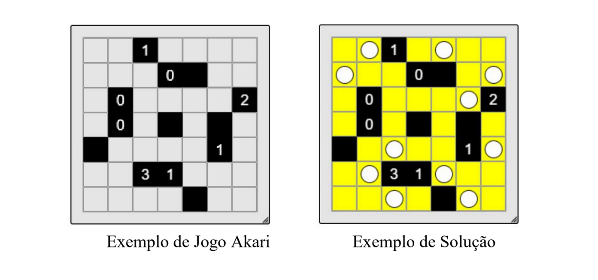

# (CTC-17) Projeto de Buscas

<!-- vscode-markdown-toc -->
* [1. Objetivo](#Objetivo)
* [2. Descrição do Trabalho](#DescriodoTrabalho)
	* [2.1 Caminho entre cidades](#Caminhoentrecidades)
		* [2.1.1 Descrição do arquivo de dados](#Descriodoarquivodedados)
	* [2.2 Light up](#Lightup)
		* [2.2.1 Modelagem](#Modelagem)
		* [2.2.2 Implementação](#Implementao)

<!-- vscode-markdown-toc-config
	numbering=false
	autoSave=true
	/vscode-markdown-toc-config -->
<!-- /vscode-markdown-toc -->

## 1. Objetivo

Exercitar e fixar conhecimentos adquiridos sobre Resolução de Problemas através de Busca de Melhoria Iterativa (onde o destino é a solução, não o caminho) e sobre Problema de Satisfação de Restrições.

## 2. Descrição do Trabalho

### 2.1 Caminho entre cidades
Crie um agente capaz de encontrar o menor caminho entre duas cidades, com mapa definido como segue. O agente deve receber como entradas o id da cidade origem, id da cidade destino e nome do arquivo de dados. Usando este agente encontre o menor caminho entre as cidades Alice Springs (id 5) e Yulara da Australia (id 219) do arquivo australia.csv, explicite o caminho (a lista das cidades) da solução e também a distância do início ao fim.

#### 2.1.1 Descrição do arquivo de dados
O arquivo `australia.csv` tem os seguintes campos: ID da cidade,nome da cidade, coordenada x, coordenada y, estado e população. A distância em linha reta entre as cidades pode ser calculada a partir das coordenadas cartesianas (x,y) disponibilizadas no arquivo `australia.csv`. Uma cidade com ID x se conecta com as cidades x+2 (se existir) e x-1, se x>1 e x é par. Se X é ímpar e x>2, esta cidade x se conecta com as cidades x-2 e x+1 (se existir cidade com ID x+1). Caso as cidades a existam distância pela estrada é 10% maior que a distância em linha reta.

### 2.2 Light up
Crie um agente capaz de resolver o jogo chamado Akari utilizando algoritmos de busca heurística, melhoria iterativa ou satisfação de restrição. (Ver regras abaixo).

#### 2.2.1 Modelagem
Explicite a sua modelagem para resolver o problema.

#### 2.2.2 Implementação
Implemente os algoritmos para a resolução do problema, na linguagem de sua escolha. (Não utilize implementações prontas disponíveis na Internet, nem frameworks que implementem o métodos de resolução escolhido. Você pode usar apenas bibliotecas que facilitem a implementação das estruturas de dados necessárias).

x (impar)    (x - 2)       (x + 1)       (x + 2)
(x + 2)      (x)